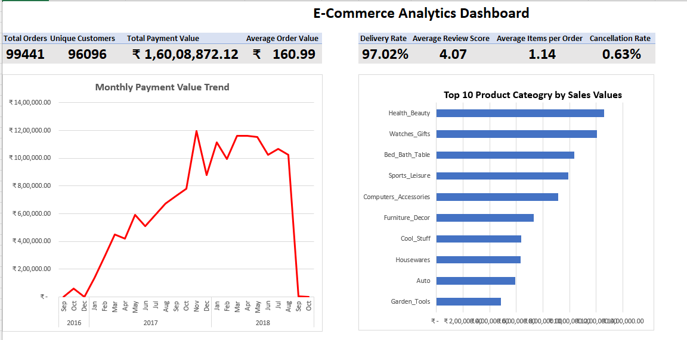
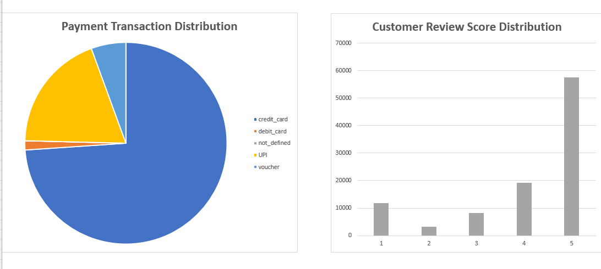
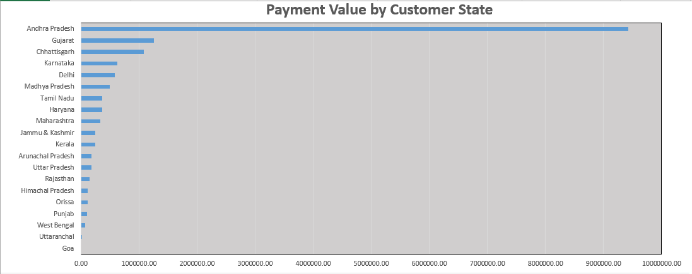
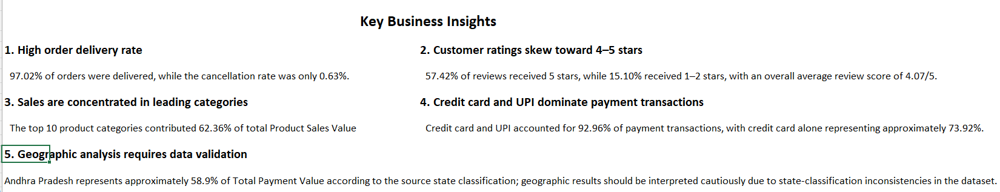

```markdown
# E-Commerce Data Analysis & Interactive Excel Dashboard

An end-to-end e-commerce data analytics project built using Microsoft Excel, Power Query, Power Pivot, DAX, PivotTables, and PivotCharts.

The project focuses on transforming raw transactional data into a structured analytical data model, calculating business KPIs, identifying trends and patterns, and presenting insights through an interactive Excel dashboard.

---

## 📊 Dashboard Preview



---

## 🎯 Project Objectives

The objective of this project was to analyze e-commerce business data and answer key business questions related to:

- Overall order and payment performance
- Customer activity and purchasing behavior
- Product category performance
- Payment method usage
- Customer satisfaction and review patterns
- Delivery and order fulfillment performance
- Geographic distribution of payment value
- Monthly sales/payment trends

---

## 🛠️ Tools & Technologies

| Tool | Purpose |
|---|---|
| Microsoft Excel | Data analysis and dashboard development |
| Power Query | Data cleaning and transformation |
| Power Pivot | Data modeling and relationships |
| DAX | KPI and analytical measure creation |
| PivotTables | Data aggregation and analysis |
| PivotCharts | Interactive data visualization |

---

## 🔄 Project Workflow

```text
Raw Data
   ↓
Data Import
   ↓
Data Cleaning & Transformation
   ↓
Data Quality Audit
   ↓
Data Modeling
   ↓
DAX Measures
   ↓
PivotTables & PivotCharts
   ↓
Interactive Dashboard
   ↓
Business Insights
```

---

## 🧹 Data Preparation & Cleaning

Power Query was used extensively to prepare the datasets for analysis.

Key data preparation steps included:

- Converted raw timestamp fields into separate date and time fields
- Standardized date formats
- Checked for duplicate records
- Validated primary and composite keys
- Checked for missing and invalid values
- Investigated zero and negative numeric values
- Replaced literal `N/A` product categories with `Unknown`
- Treated invalid zero product weights as missing values
- Treated invalid zero payment-installment values as missing
- Preserved meaningful zero freight/payment values
- Validated review scores against the expected 1–5 range
- Performed order-status and delivery-date quality checks

Rather than blindly removing unusual records, anomalies were investigated and retained where they represented legitimate source-data conditions.

---

## 🔗 Data Model

The project uses a relational data model created with Power Pivot.

### Main relationships

```text
CUSTOMERS
    │
    ▼
  ORDERS
    │
    ├──────────────► ORDER_PAYMENTS
    │
    ├──────────────► ORDER_REVIEW_RATINGS
    │
    ▼
ORDER_ITEMS
    │
    ├──────────────► PRODUCTS
    │
    └──────────────► SELLERS
```

### Tables

- `ORDERS`
- `ORDER_ITEMS`
- `PRODUCTS`
- `ORDER_PAYMENTS`
- `ORDER_REVIEW_RATINGS`
- `CUSTOMERS`
- `SELLERS`

The model allows different business dimensions to be analyzed while maintaining appropriate relationships between transactional and reference data.

---

## 📈 Key KPIs

| KPI | Value |
|---|---:|
| Total Orders | 99,441 |
| Total Payment Value | ₹1,60,08,872.12 |
| Average Order Value | ₹160.99 |
| Unique Customers | 96,096 |
| Delivered Orders | 96,478 |
| Delivery Rate | 97.02% |
| Canceled Orders | 625 |
| Cancellation Rate | 0.63% |
| Items Sold | 112,650 |
| Average Items per Order | 1.14 |
| Average Review Score | 4.07 / 5 |
| Unavailable Orders | 609 |
| Unavailable Rate | 0.61% |

---

## 🧮 DAX Measures

Examples of measures created using DAX include:

```DAX
Total Orders :=
DISTINCTCOUNT(orders[order_id])
```

```DAX
Total Payment Value :=
SUM(order_payment[payment_value])
```

```DAX
Average Order Value :=
DIVIDE(
    [Total Payment Value],
    DISTINCTCOUNT(order_payment[order_id])
)
```

```DAX
Unique Customers :=
DISTINCTCOUNT(customers[customer_unique_id])
```

```DAX
Delivered Orders :=
CALCULATE(
    DISTINCTCOUNT(orders[order_id]),
    orders[order_status] = "delivered"
)
```

```DAX
Delivery Rate :=
DIVIDE(
    [Delivered Orders],
    DISTINCTCOUNT(orders[order_id])
)
```

```DAX
Cancellation Rate :=
DIVIDE(
    [Canceled Orders],
    DISTINCTCOUNT(orders[order_id])
)
```

```DAX
Average Review Score :=
AVERAGE(order_review_rating[review_score])
```

A separate `Product Sales Value` measure was used for product/category analysis so that category filters correctly operate through the `ORDER_ITEMS` branch of the data model.

---

## 📊 Dashboard Analysis

The dashboard combines multiple analytical views into a single management-style report.

### 1. Monthly Payment Value Trend



The monthly trend shows the evolution of payment value across the available period. Partial-year periods are interpreted cautiously when comparing them with complete years.

---

### 2. Top 10 Product Categories



The analysis identifies the leading product categories by Product Sales Value.

The top 10 categories contributed approximately **62.36%** of total Product Sales Value, indicating significant concentration among leading categories.

---

### 3. Payment & Review Analysis



The payment analysis shows that:

- Credit card transactions represented approximately **73.92%**
- UPI represented approximately **19.04%**
- Credit card and UPI together represented approximately **92.96%** of payment transactions

Customer review analysis shows:

- **57.42%** of reviews were rated 5 stars
- **76.62%** of reviews were rated 4 or 5 stars
- **15.10%** of reviews were rated 1 or 2 stars
- Average review score: **4.07 / 5**

---

## 💡 Key Business Insights

### 1. High Order Delivery Rate

97.02% of orders were delivered, while the cancellation rate was 0.63%.

### 2. Customer Ratings Skew Toward 4–5 Stars

57.42% of reviews received 5 stars, while 15.10% received 1–2 stars. The overall average review score was 4.07/5.

### 3. Sales Are Concentrated in Leading Categories

The top 10 product categories contributed approximately 62.36% of total Product Sales Value.

### 4. Credit Card and UPI Dominate Payment Transactions

Credit card and UPI together accounted for approximately 92.96% of payment transactions, with credit card alone representing approximately 73.92%.

### 5. Geographic Analysis Requires Data Validation

The customer-state field shows classification inconsistencies in some records. For example, some locations that would currently be associated with Telangana appear under Andhra Pradesh in the source classification.

Therefore, the geographic analysis is presented as a view of the **source data classification** rather than as a definitive representation of current state-level geography.

---

## 🔍 Data Quality Considerations

Several data-quality conditions were identified during the project.

### Order Delivery Dates

Some orders had missing carrier or customer delivery timestamps. Most were associated with non-delivered statuses, while a small number of delivered orders had missing delivery timestamps.

These records were retained rather than artificially filling missing dates.

### Product Data

Some product attributes contained missing values.

Product weights recorded as zero were investigated and treated as missing because zero weight is not meaningful for a physical product.

### Payment Data

A small number of payment records contained zero payment values. These were retained because they may represent specific payment conditions such as vouchers or undefined payment records.

Invalid zero installment values were treated as missing.

### Geographic Classification

The customer-state field contains classification inconsistencies. Geographic results should therefore be interpreted with this limitation in mind.

---

## 📁 Repository Structure

```text
ecommerce-excel-data-analysis/
│
├── Dashboard/
│   ├── dashboard_overview.png
│   ├── monthly_trend.png
│   ├── payment_and_reviews.png
│   └── product_categories.png
│
├── Excel/
│   └── Ecommerce_Analytics_Dashboard.xlsx
│
├── .gitattributes
└── README.md
```

---

## 📚 Skills Demonstrated

This project demonstrates practical experience with:

- Data cleaning
- Data quality auditing
- Data transformation
- Relational data modeling
- Power Query
- Power Pivot
- DAX
- Excel PivotTables
- PivotCharts
- KPI development
- Business analysis
- Dashboard design
- Data visualization
- Insight generation
- Git & GitHub
- Git LFS

---

## 🚀 Project Outcome

This project demonstrates an end-to-end analytics workflow in Excel, starting from raw transactional data and progressing through data cleaning, validation, modeling, KPI development, visualization, and business insight generation.

The final dashboard provides a consolidated view of e-commerce performance and can be used as a portfolio example of practical data analytics and business intelligence skills.

---

## 👤 Author

**Maaz Alam**

B.Tech — Computer Science & Engineering

GitHub: [@maaz-alam04](https://github.com/maaz-alam04)
```

### One important thing

The README contains **relative image paths**, such as:

```markdown

```
